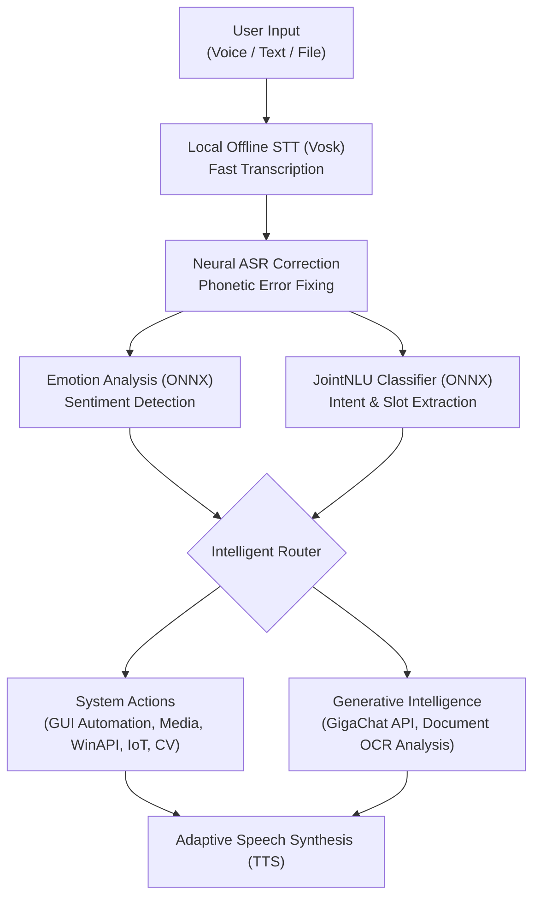
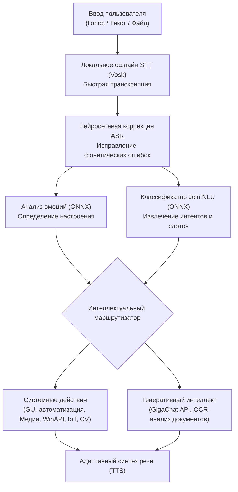

# 🌟 Astra — AI Voice Assistant & Desktop Copilot

  

  <b>A next-generation personal autonomous voice assistant for Windows</b> 
  Combines a hybrid local NLP/NLU pipeline, integration with large language models, computer vision, and deep OS automation.

  
  
  
  
  

---

## EN Version:

---

## 📌 About the Project

**Astra** is a modular desktop assistant designed for full voice and gesture control over your PC, multimedia, and smart devices.

Unlike standard cloud-based solutions, Astra uses a **hybrid architecture**: critical tasks (STT, intent classification NLU, gestures, Face ID, emotion recognition) are performed **locally using ONNX models**, while generative dialogue and heavy document processing are delegated to the neural network intelligence of the **GigaChat API**.

---

## ✨ Key Features

### 🎙️ Speech Recognition, NLU & Emotions
* **Offline STT & JointNLU:** Fast local command recognition via Vosk and an ONNX-based JointNLU encoder with zero network latency.
* **ASR Post-correction:** Intelligent correction of phonetic recognition errors in Russian speech.
* **Voice Emotion Analysis:** Detects user sentiment (joy, sadness, neutral) and adapts responses to the user's mood.

### 👁️ Computer Vision Modules
* **Face ID (Owner Recognition):** Greets the user when they appear in front of the webcam and protects the system from unauthorized persons.
* **Gesture PC Control:** Touchless multimedia control (pause with palm, screen lock with fist, etc.) using MediaPipe.
* **Eye Fatigue Monitoring:** Tracks blink frequency and eye-closure duration, with caring reminders to take breaks.

### 🌐 Networking, VPN & Bypass
* **Intelligent GUI VPN Management:** Automatically launches, configures, and switches modes for **Happ**, **Sota Connect**, **V2Ray/Xray**, and **WireGuard** clients, with protection against accidental clicks and UI glitches.
* **Zapret (winws) Integration:** Quickly switch DPI bypass and blocking strategies by voice.

### 🎵 Multimedia & Smart Home
* **Yandex Music & Spotify:** Launch personalized recommendation waves, search for tracks, skip songs, and like tracks.
* **Yandex Smart Home (IoT):** Voice control of lighting, scenes, lamp brightness, and sockets via API.
* **YouTube & Video:** Search and instantly launch videos in full-screen mode.

### 📱 Telegram Remote Bot
* Remote control of your computer via a secure Telegram bot.
* Quick owner account binding directly from settings using a **QR code**.
* Capture camera snapshots, screenshots, and check system status from afar.

### 📄 Document Analysis
* Drag-and-drop file attachment support (`.pdf`, `.docx`, `.txt`, scans/images).
* Built-in OCR and content summarization via LLM.

---

## 🗣️ Example Voice Commands

Astra understands natural speech without the need to memorize rigid phrases:

| Category | Example Commands |
| :--- | :--- |
| **🎵 Music & Media** | "Play My Wave", "Like this track", "Next song", "Launch Spotify", "Find Python lectures on YouTube" |
| **🌐 VPN & Bypass** | "Turn on Happ", "Turn off VPN", "Connect Sota", "Launch Zapret", "Select the seventh bypass" |
| **💡 Smart Home** | "Turn on the lights", "Turn off the chandelier", "Set backlight brightness to 40%", "Turn off the socket" |
| **🚀 Modes & System** | "Work mode" *(opens work websites/software)*, "Relaxation mode", "Lower the volume", "Shut down the computer" |
| **🧠 Dialogue & Documents** | *(Drag a file into the chat)* → "Study this report and highlight the key points", "What's the weather today?", "How are you doing?" |

---

## ⚙️ Architecture & Processing Pipeline

User request processing goes through a multi-level pipeline with local inference prioritized:

---

## 🔌 Supported Services and Ecosystem

| Category | Services and Modules |
| :--- | :--- |
| **Neural Network Intelligence** | Sber GigaChat API, JointNLU (ONNX), Emotion Classifier, RapidOCR |
| **Network Clients & VPN** | Happ (GUI adapter), Sota Connect, WireGuard, V2Ray / Xray Core, Zapret (WinWS) |
| **Multimedia & IoT** | Yandex Music, Spotify Web API, Home with Alice (Yandex Smart Home IoT), YouTube Data API |
| **Vision & Biometrics** | Face ID (Dlib / Face Recognition), MediaPipe Gestures, Eye Fatigue Monitor |
| **Remote Access** | Telegram Bot API (aiogram 3.x) with dynamic QR-code binding |

---

## 🛡️ Privacy and Data Locality

* **Offline vision processing:** Face recognition, eye fatigue monitoring, and gesture recognition modules operate exclusively on the user's local PC. Video stream from the webcam is never transmitted to external cloud services.
* **Local configuration storage:** All API keys, tokens, and face templates (`owner_face`) are stored locally in the `personal_data/` directory in encrypted or isolated form.

---

## 📄 License
This project is distributed under the [CC BY-NC 4.0](https://creativecommons.org/licenses/by-nc/4.0/) license. Non-commercial use, study, and modification are permitted with mandatory attribution.

---

## RU Версия

---

## 📌 О проекте

**Astra** — это модульный десктопный ассистент, предназначенный для полноценного голосового и жестового управления вашим ПК, мультимедиа и умными устройствами.

В отличие от стандартных облачных решений, Astra использует **гибридную архитектуру**: критические задачи (STT, классификация интентов NLU, жесты, Face ID, распознавание эмоций) выполняются **локально с использованием ONNX-моделей**, а генеративные диалоги и обработка тяжёлых документов делегируются нейросетевому интеллекту **GigaChat API**.

---

## ✨ Ключевые возможности

### 🎙️ Распознавание речи, NLU и эмоции
* **Офлайн STT и JointNLU:** Быстрое локальное распознавание команд с помощью Vosk и ONNX-энкодера JointNLU с нулевой задержкой сети.
* **Посткоррекция ASR:** Интеллектуальное исправление фонетических ошибок распознавания русской речи.
* **Голосовой анализ эмоций:** Определяет настроение пользователя (радость, грусть, нейтральное) и адаптирует ответы под эмоциональное состояние.

### 👁️ Модули компьютерного зрения
* **Face ID (распознавание владельца):** Приветствует пользователя при появлении перед веб-камерой и защищает систему от посторонних.
* **Жестовое управление ПК:** Бесконтактное управление мультимедиа (пауза ладонью, блокировка экрана кулаком и т.д.) с использованием MediaPipe.
* **Мониторинг усталости глаз:** Отслеживает частоту моргания и длительность закрытия глаз с заботливыми напоминаниями о необходимости сделать перерыв.

### 🌐 Сеть, VPN и обход блокировок
* **Интеллектуальное GUI-управление VPN:** Автоматически запускает, настраивает и переключает режимы для клиентов **Happ**, **Sota Connect**, **V2Ray/Xray** и **WireGuard** с защитой от случайных кликов и сбоев интерфейса.
* **Интеграция с Zapret (winws):** Быстрое переключение стратегий обхода DPI и блокировок голосом.

### 🎵 Мультимедиа и умный дом
* **Yandex Music и Spotify:** Запуск персонализированных волн рекомендаций, поиск треков, пропуск песен и добавление в понравившееся.
* **Яндекс Умный Дом (IoT):** Голосовое управление освещением, сценами, яркостью ламп и розетками через API.
* **YouTube и видео:** Поиск и мгновенный запуск видео в полноэкранном режиме.

### 📱 Удалённый Telegram-бот
* Удалённое управление компьютером через защищённого Telegram-бота.
* Быстрая привязка аккаунта владельца прямо из настроек с помощью **QR-кода**.
* Получение снимков с камеры, скриншотов и проверка состояния системы издалека.

### 📄 Анализ документов
* Поддержка прикрепления файлов (`.pdf`, `.docx`, `.txt`, сканы/изображения).
* Встроенная OCR и суммаризация содержимого через LLM.

---

## 🗣️ Примеры голосовых команд

Astra понимает естественную речь без необходимости заучивать жёсткие фразы:

| Категория | Примеры команд |
| :--- | :--- |
| **🎵 Музыка и медиа** | "Включи мою волну", "Лайкни этот трек", "Следующая песня", "Запусти Spotify", "Найди на YouTube лекции по Python" |
| **🌐 VPN и обход** | "Включи Happ", "Выключи VPN", "Подключи Sota", "Запусти Zapret", "Выбери седьмой обход" |
| **💡 Умный дом** | "Включи свет", "Выключи люстру", "Установи яркость подсветки на 40%", "Выключи розетку" |
| **🚀 Режимы и система** | "Рабочий режим" *(открывает рабочие сайты/программы)*, "Режим релаксации", "Убавь громкость", "Выключи компьютер" |
| **🧠 Диалоги и документы** | *(Перетащите файл в чат)* → "Изучи этот отчёт и выдели ключевые моменты", "Какая сегодня погода?", "Как у тебя дела?" |

---

## ⚙️ Архитектура и конвейер обработки

Обработка запроса пользователя проходит через многоуровневый конвейер с приоритетом локального вывода:

---

## 🔌 Поддерживаемые сервисы и экосистема

| Категория | Сервисы и модули |
| :--- | :--- |
| **Нейросетевой интеллект** | Sber GigaChat API, JointNLU (ONNX), Emotion Classifier, RapidOCR |
| **Сетевые клиенты и VPN** | Happ (GUI-адаптер), Sota Connect, WireGuard, V2Ray / Xray Core, Zapret (WinWS) |
| **Мультимедиа и IoT** | Yandex Music, Spotify Web API, Home with Alice (Yandex Smart Home IoT), YouTube Data API |
| **Зрение и биометрия** | Face ID (Dlib / Face Recognition), MediaPipe Gestures, Eye Fatigue Monitor |
| **Удалённый доступ** | Telegram Bot API (aiogram 3.x) с привязкой по динамическому QR-коду |

---

## 🛡️ Приватность и локальность данных

* **Офлайн-обработка зрения:** Модули распознавания лица, усталости глаз и жестов работают исключительно на локальном ПК пользователя. Видеопоток с веб-камеры никогда не передаётся во внешние облачные сервисы.
* **Локальное хранение конфигураций:** Все ключи API, токены и шаблоны лиц (`owner_face`) хранятся локально в директории `personal_data/` в зашифрованном или изолированном виде.

---

## 📄 Лицензия
Проект распространяется под лицензией [CC BY-NC 4.0](https://creativecommons.org/licenses/by-nc/4.0/). Разрешено некоммерческое использование, изучение и модификация с обязательным указанием авторства.