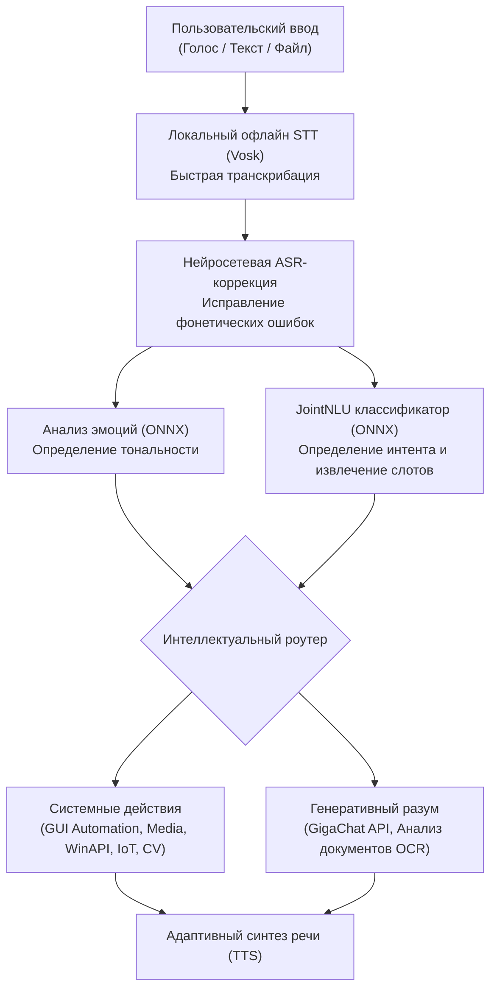

# 🌟 Astra (Астра) — AI Voice Assistant & Desktop Copilot

  

  <b>Персональный автономный голосовой ассистент нового поколения для Windows</b> 
  Сочетает гибридный локальный NLP/NLU пайплайн, интеграцию с большими языковыми моделями, компьютерное зрение и глубокую автоматизацию операционной системы.

  
  
  
  
  

---

## 📌 О проекте

**Астра** — это модульный настольный ассистент, спроектированный для полного голосового и жестового контроля над ПК, мультимедиа и умными устройствами. 

В отличие от стандартных облачных решений, Астра использует **гибридную архитектуру**: критические задачи (STT, классификация интентов NLU, жесты, Face ID, распознавание эмоций) выполняются **локально на ONNX-моделях**, а генеративный диалог и обработка тяжелых документов делегируются нейросетевому разуму **GigaChat API**.

---

## ✨ Ключевые возможности

### 🎙️ Распознавание речи, NLU и эмоции
* **Офлайн STT & JointNLU:** Быстрое локальное распознавание команд через Vosk и энкодер JointNLU на базе ONNX без задержек сети.
* **ASR Пост-коррекция:** Интеллектуальное исправление ошибок фонетического распознавания русской речи.
* **Анализ эмоций голоса:** Определение тональности пользователя (радость, грусть, нейтральный) и адаптация ответов под настроение.

### 👁️ Модули компьютерного зрения
* **Face ID (Распознавание владельца):** Приветствие пользователя при появлении перед веб-камерой и защита системы от посторонних.
* **Управление ПК жестами:** Бесконтактное управление мультимедиа (пауза ладонью, блокировка экрана кулаком и др.) через MediaPipe.
* **Контроль усталости глаз:** Отслеживание частоты моргания и продолжительности закрытия глаз с заботливыми напоминаниями об отдыхе.

### 🌐 Сеть, VPN и обход блокировок
* **Интеллектуальное GUI-управление VPN:** Автоматический запуск, разворачивание и переключение режимов для клиентов **Happ**, **Sota Connect**, **V2Ray/Xray** и **WireGuard** с защитой от ложных кликов и сбоев интерфейса.
* **Интеграция с Zapret (winws):** Быстрое переключение стратегий обхода DPI и блокировок голосом.

### 🎵 Мультимедиа и Умный дом
* **Яндекс Музыка & Spotify:** Запуск персональной волны рекомендаций, поиск треков, переключение и расстановка лайков.
* **Умный дом Яндекса (IoT):** Голосовое управление освещением, сценариями, яркостью ламп и розетками по API.
* **YouTube и видео:** Поиск и мгновенное разворачивание роликов на полный экран.

### 📱 Telegram Remote Bot
* Удаленный пульт управления компьютером через защищенный Telegram-бот.
* Быстрая привязка аккаунта владельца прямо из настроек через **QR-код**.
* Снятие снимков с камеры, скриншотов и проверка статуса системы на расстоянии.

### 📄 Анализ документов
* Поддержка drag-and-drop прикрепления файлов (`.pdf`, `.docx`, `.txt`, сканы/изображения).
* Встроенный оптический OCR и суммаризация содержимого через LLM.

---

## 🗣️ Примеры голосовых команд

Астра распознаёт естественную речь без необходимости заучивать строгие фразы:

| Категория | Примеры команд |
| :--- | :--- |
| **🎵 Музыка & Медиа** | «Включи Мою волну», «Поставь лайк треку», «Следующая песня», «Вруби Spotify», «Найди на YouTube лекции по Python» |
| **🌐 VPN и Обход** | «Включи Хапп», «Выруби VPN», «Подключи Соту», «Запусти Запрет», «Выбери седьмой обход» |
| **💡 Умный дом** | «Включи свет», «Погаси люстру», «Яркость подсветки 40%», «Выключи розетку» |
| **🚀 Режимы и Система** | «Рабочий режим» *(откроет рабочие сайты/софт)*, «Режим отдыха», «Сделай потише», «Выключи компьютер» |
| **🧠 Диалог и Документы** | *(Перетащить файл в чат)* $\rightarrow$ «Изучи этот отчет и выдели главные тезисы», «Какая сегодня погода?», «Как твои дела?» |

---

## ⚙️ Архитектура и пайплайн обработки

Обработка пользовательского запроса проходит многоуровневый конвейер с приоритетом локального инференса:

---

## 🔌 Поддерживаемые сервисы и экосистема

| Направление | Сервисы и модули |
| :--- | :--- |
| **Нейросетевой интеллект** | Сбер GigaChat API, JointNLU (ONNX), Emotion Classifier, RapidOCR |
| **Сетевые клиенты & VPN** | Happ (GUI-адаптер), Sota Connect, WireGuard, V2Ray / Xray Core, Zapret (WinWS) |
| **Мультимедиа & IoT** | Яндекс Музыка, Spotify Web API, Дом с Алисой (Yandex Smart Home IoT), YouTube Data API |
| **Зрение & Биометрия** | Face ID (Dlib / Face Recognition), MediaPipe Gestures, Eye Fatigue Monitor |
| **Удаленный доступ** | Telegram Bot API (aiogram 3.x) с привязкой по динамическому QR-коду |

---

## 🛡️ Приватность и локальность данных

* **Офлайн-обработка зрения:** Модули распознавания лица, усталости глаз и жестов работают исключительно на локальном ПК пользователя. Видеопоток с веб-камеры никогда не передаётся во внешние облачные сервисы.
* **Локальное хранение конфигураций:** Все ключи API, токены и шаблоны лиц (`owner_face`) хранятся локально в директории `personal_data/` в зашифрованном или изолированном виде.