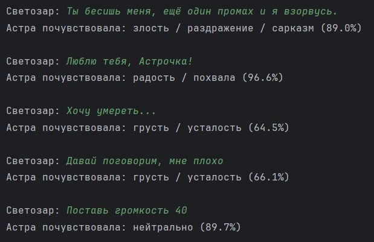
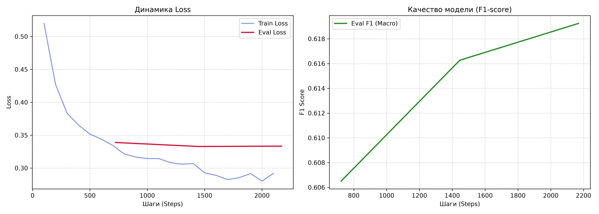
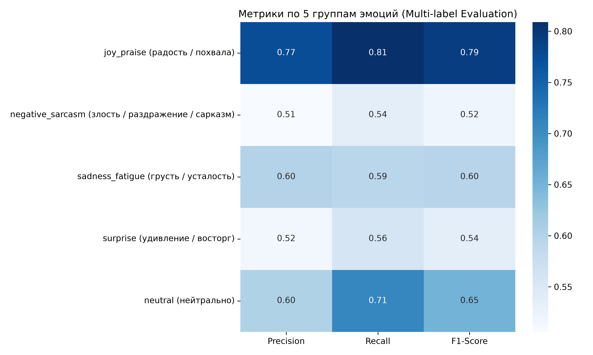
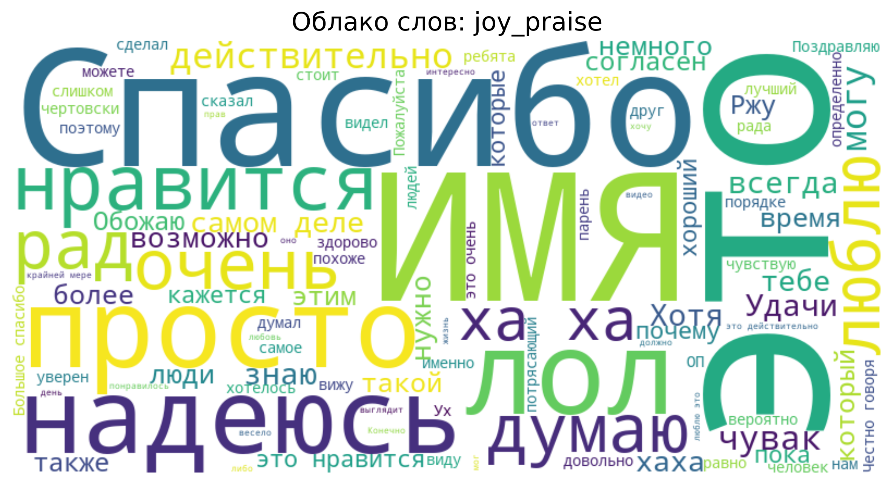
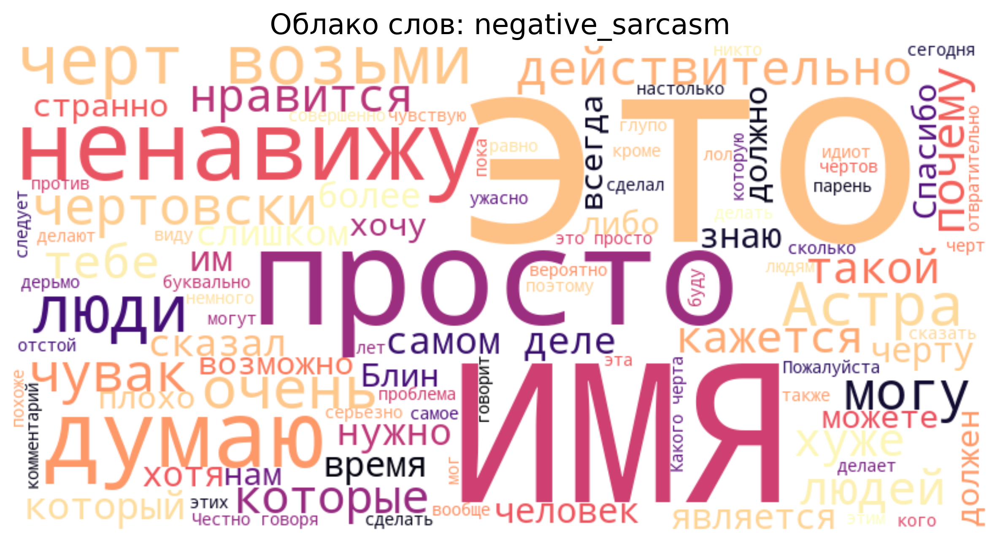
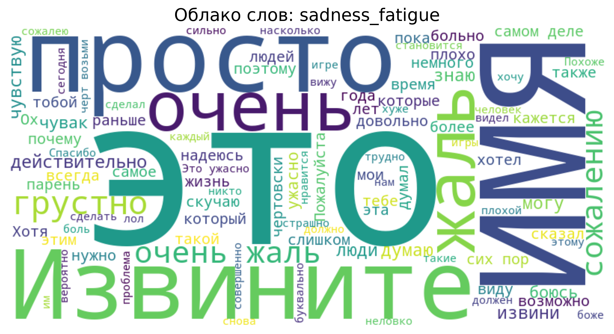
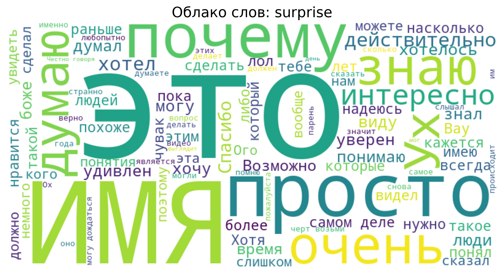
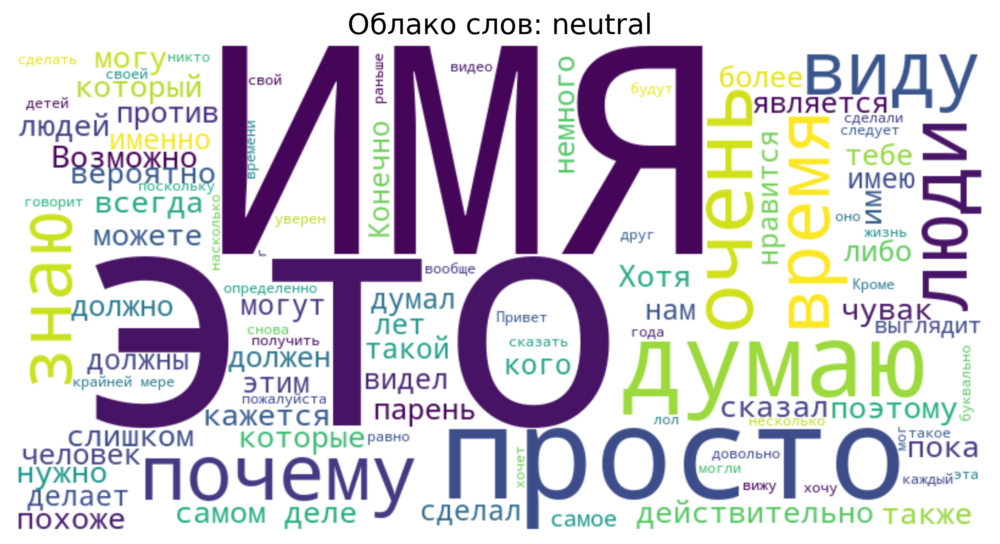

## EN version
---

# 🎭 Astra Text Emotions

A lightweight module for emotion recognition and sentiment analysis of Russian-language chat text for the **Astra** personal assistant.

Built on top of a fine-tuned **`cointegrated/rubert-tiny2`** model with subsequent quantization to **INT8 ONNX** for ultra-fast CPU inference without using GPU resources.

---

## ⚡ Features

* **5 concise macro-emotions:** praise/joy, sarcasm/irritation/anger, sadness/fatigue, surprise, and dry commands.
* **Chat context understanding:** the model is adapted to slang, internet punctuation (parentheses, ellipses), caps, and hidden passive aggression.
* **Ultra-lightweight:** compression of the original weights from 115 MB down to **~29 MB** in INT8 format.
* **Lightning-fast inference:** **2–5 ms response on a regular CPU** via ONNX Runtime.
* **Self-contained:** no external network calls or APIs, the model runs fully locally.

---

## 🎯 Emotion Classes

| Class ID | Russian name | Description and examples |
|---|---|---|
| `joy_praise` | Joy / praise | Sincere gratitude, positivity, delight (*"You're the best, thank you so much!"*) |
| `negative_sarcasm` | Anger / irritation / sarcasm | Passive aggression, irony, swearing (*"Brilliant, everything broke again"*, *"You're driving me crazy"*) |
| `sadness_fatigue` | Sadness / fatigue | Burnout, complaints, loss of energy (*"I've been stuck on this bug for five hours, I'm exhausted"*) |
| `surprise` | Surprise / delight | Unexpectedness, keen interest (*"Wow, how did you manage that so fast!"*) |
| `neutral` | Neutral | Everyday commands, timers, weather questions (*"Set the volume to 40"*) |

---

## 📁 Project Structure

```text
astra_text_emotions/
├── dataset/
│   ├── ru_go_emotions/          # Base dataset (seara/ru_go_emotions)
│   └── custom_emotions.json     # Custom Astra dialogue utterances
├── models/
│   ├── rubert-tiny2/            # Original pretrained encoder
│   └── astra_text_emotions/     # Trained model and quantized ONNX
│       └── astra_text_emotions_int8.onnx
├── prepare_train/
│   ├── download_assets.py       # Downloading weights and dataset
│   └── generate_wordclouds.py   # Generating word clouds by category
├── results/                     # Convergence plots, matrices, and word clouds
├── train/
│   ├── config.py                # Configuration of paths, mappings, and hyperparameters
│   ├── train.py                 # Training and validation pipeline
│   ├── export_onnx.py           # Export and INT8 dynamic quantization
│   ├── inference.py             # Inference via PyTorch
│   ├── inference_onnx.py        # Production inference via ONNX Runtime
│   └── visualize_results.py     # Building metric heatmaps and loss curves
└── requirements.txt
```

---

## 📊 Results and Metrics

### 💬 Real Dialogue Testing

<p align="center">
  
</p>

---

### 📈 Convergence and Class Heatmap

| Learning curves (Loss & F1) | Metrics across 5 emotion groups |
| :---: | :---: |
|  |  |

---

### ☁️ Keyword Word Clouds

<details>
<summary><b>View word clouds by emotion category (click to expand)</b></summary>
<br>

| Joy and praise | Anger, sarcasm, and irritation |
| :---: | :---: |
|  |  |

| Sadness and fatigue | Surprise and delight |
| :---: | :---: |
|  |  |

| Neutral commands | |
| :---: | :---: |
|  | |

</details>

---
## RU версия
---

# 🎭 Astra Text Emotions

Легковесный модуль распознавания эмоций и тональности русскоязычного текста в чате для персонального ассистента **Astra**. 

Построен на базе дообученной модели **`cointegrated/rubert-tiny2`** с последующим квантованием в **INT8 ONNX** для сверхбыстрого инференса на CPU без использования GPU-ресурсов.

---

## ⚡ Особенности

* **5 емких макро-эмоций:** похвала/радость, сарказм/раздражение/злость, грусть/усталость, удивление и сухие команды.
* **Понимание контекста чата:** модель адаптирована под сленг, интернет-пунктуацию (скобочки, многоточия), капс и скрытую пассивную агрессию.
* **Ультралегкий вес:** сжатие исходных весов со 115 МБ до **~29 МБ** в формате INT8.
* **Молниеносный инференс:** отклик **2–5 мс на обычном CPU** через ONNX Runtime.
* **Автономность:** отсутствие внешних сетевых вызовов и API, модель функционирует полностью локально.

---

## 🎯 Классы эмоций

| Идентификатор класса | Русское название | Описание и примеры |
|---|---|---|
| `joy_praise` | Радость / похвала | Искренняя благодарность, позитив, восторг (*«Ты лучшая, спасибо огромное!»*) |
| `negative_sarcasm` | Злость / раздражение / сарказм | Пассивная агрессия, ирония, ругань (*«Гениально, опять все сломалось»*, *«Бесишь»*) |
| `sadness_fatigue` | Грусть / усталость | Выгорание, жалобы, упадок сил (*«Сижу над багом пятый час, сил нет»*) |
| `surprise` | Удивление / восторг | Неожиданность, яркий интерес (*«Ого, как ты быстро справилась!»*) |
| `neutral` | Нейтрально | Бытовые команды, таймеры, вопросы о погоде (*«Поставь громкость на 40»*) |

---

## 📁 Структура проекта

```text
astra_text_emotions/
├── dataset/
│   ├── ru_go_emotions/          # Базовый датасет (seara/ru_go_emotions)
│   └── custom_emotions.json     # Пользовательские диалоговые реплики Астры
├── models/
│   ├── rubert-tiny2/            # Исходный предобученный энкодер
│   └── astra_text_emotions/     # Обученная модель и квантованный ONNX
│       └── astra_text_emotions_int8.onnx
├── prepare_train/
│   ├── download_assets.py       # Загрузка весов и датасета
│   └── generate_wordclouds.py   # Генерация облаков слов по категориям
├── results/                     # Графики сходимости, матрицы и облака слов
├── train/
│   ├── config.py                # Конфигурация путей, маппингов и гиперпараметров
│   ├── train.py                 # Пайплайн обучения и валидации
│   ├── export_onnx.py           # Экспорт и INT8 динамическое квантование
│   ├── inference.py             # Инференс через PyTorch
│   ├── inference_onnx.py        # Продакшн-инференс через ONNX Runtime
│   └── visualize_results.py     # Построение тепловых карт метрик и loss-кривых
└── requirements.txt
```

---

## 📊 Результаты и метрики

### 💬 Тестирование в реальном диалоге

<p align="center">
  
</p>

---

### 📈 Сходимость и тепловая карта классов

| Кривые обучения (Loss & F1) | Метрики по 5 группам эмоций |
| :---: | :---: |
|  |  |

---

### ☁️ Облака ключевых слов (Word Clouds)

<details>
<summary><b>Посмотреть облака слов по категориям эмоций (нажми, чтобы развернуть)</b></summary>
<br>

| Радость и похвала | Злость, сарказм и раздражение |
| :---: | :---: |
|  |  |

| Грусть и усталость | Удивление и восторг |
| :---: | :---: |
|  |  |

| Нейтральные команды | |
| :---: | :---: |
|  | |

</details>

